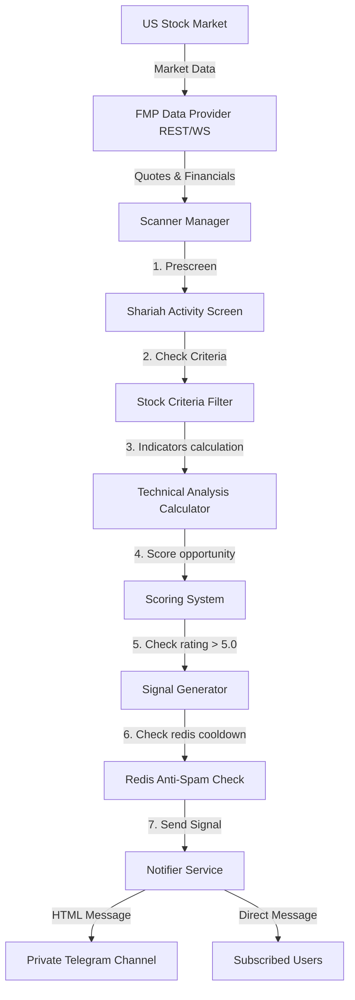
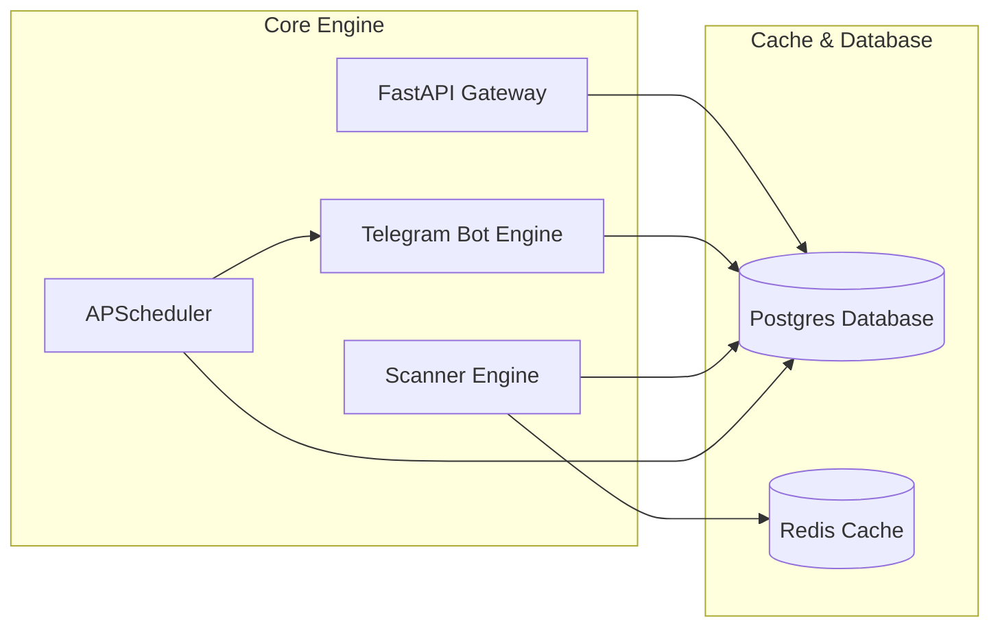

# MBM Radar - System Architecture

This document describes the flow of information and components relationship inside MBM Radar.

---

## 1. Flow Diagram: Market Scanner to Telegram Notification

---

## 2. Core Service Relationships

---

## 3. Database Schema

The database schema manages user states, preferences, active subscription statuses, generated signals, and logging metadata:
- **users**: Main registry mapping Telegram chat IDs to usernames and configurations.
- **user_preferences**: Technical alerts filtering limits for each user (Max Price, Max Float, Min RVOL, Gap%).
- **plans**: Pricing plans configuration details.
- **subscriptions**: Links users to active plan periods and status.
- **signals**: History of generated alert signals with calculations.
- **stocks**: Cached Shariah screening status for US stock tickers.
- **watchlist**: Subscribed user lists of target tickers.
